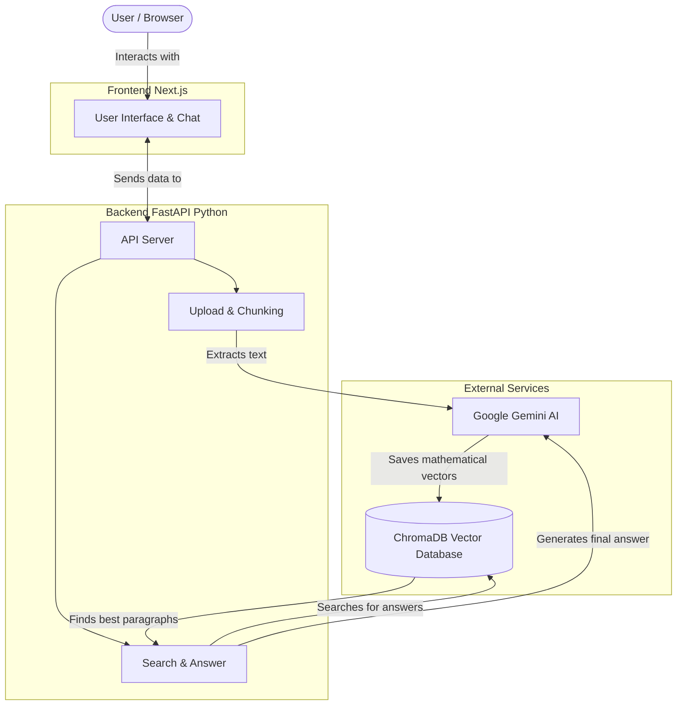

# DocuMind — Technical Overview

Welcome to the technical documentation for **DocuMind**! 

This guide is written to be easily understood by anyone—whether you are a recruiter, a hiring manager, or a fellow developer. It explains how the app works behind the scenes without getting lost in overly complex jargon.

---

## Table of Contents
1. [How It Works (The Big Picture)](#1-how-it-works-the-big-picture)
2. [Step-by-Step: Uploading and Asking Questions](#2-step-by-step-uploading-and-asking-questions)
3. [The "Anti-Hallucination" Guardrails](#3-the-anti-hallucination-guardrails)
4. [Why I Chose These Technologies](#4-why-i-chose-these-technologies)
5. [API Overview](#5-api-overview)
6. [Future Improvements](#6-future-improvements)

---

## 1. How It Works (The Big Picture)

DocuMind is an AI-powered app that lets you talk to your PDF documents. 

Instead of just blindly asking an AI to answer a question (which often leads to the AI making things up), DocuMind uses a technique called **RAG (Retrieval-Augmented Generation)**. 

Think of it like an open-book test. Instead of forcing the AI to memorize everything, the app finds the exact paragraphs from your PDF that contain the answer, gives them to the AI, and says, *"Answer the user's question using ONLY these paragraphs, and tell me which page you found it on."*

### System Architecture Diagram

---

## 2. Step-by-Step: Uploading and Asking Questions

### What happens when you upload a PDF?
1. **Extraction:** The app reads the PDF page-by-page and extracts all the text.
2. **Chopping it up:** It chops the text into smaller, bite-sized pieces (about a paragraph each). 
3. **Translating for AI:** It sends these pieces to Google Gemini, which translates the text into a long list of numbers (called a "vector embedding"). This helps the computer understand the *meaning* of the text, not just the exact words.
4. **Storage:** It saves these numbers in a specialized database called **ChromaDB**.

### What happens when you ask a question?
1. **Understanding the question:** The app takes your question and translates it into numbers (vectors) just like it did with the PDF.
2. **Searching:** It asks the database: *"Find the paragraphs from the PDF that have a similar meaning to this question."*
3. **Answering:** It takes the best matching paragraphs and hands them to the AI, instructing it to write a clean, cited answer based *only* on those paragraphs.

---

## 3. The "Anti-Hallucination" Guardrails

Sometimes, you might ask a question that the PDF simply doesn't contain the answer to. Normally, AI might panic and make up a fake answer (a "hallucination"). DocuMind has built-in guardrails to stop this.

### How it works:
When the database finds paragraphs that *might* answer the question, it also returns a "Distance Score" (how closely the meaning of the paragraph matches the meaning of the question).

* **Perfect Match (Green):** The distance is very small. The AI is highly confident it found the right information.
* **Partial Match (Yellow):** The distance is medium. The information is somewhat related, but might not perfectly answer the question.
* **Weak Match (Red):** The distance is very large. The app flags a ⚠️ **Hallucination Risk**. It knows the retrieved text is totally unrelated to the question, so the AI's answer shouldn't be trusted.

If the AI acts honestly and simply replies, *"I don't have enough information to answer that,"* the system recognizes this good behavior and gives it a 100% confidence score!

---

## 4. Why I Chose These Technologies

| Technology | What is it? | Why I chose it |
| :--- | :--- | :--- |
| **Next.js & React** | Frontend framework | It makes building fast, interactive user interfaces incredibly easy and looks great. |
| **Python & FastAPI** | Backend framework | Python is the best language for AI. FastAPI is incredibly fast and handles multiple requests at the same time very well. |
| **Google Gemini API** | The AI brain | It is blazingly fast, highly accurate, and has a very generous free tier for developers. |
| **ChromaDB** | Vector Database | It runs completely locally on the server. I didn't have to pay for expensive cloud databases to store the AI data. |

### Smart Design Choices
* **Conversational Memory:** The app remembers the last 3 things you said. This means you can ask *"What is the main topic?"* and then follow up with *"Can you summarize it?"* without having to repeat yourself.
* **Session Privacy:** Every user gets their own temporary workspace. You can't see someone else's documents, and they can't see yours.
* **Performance Tracking:** The app tracks exactly how many milliseconds it takes to search the database vs. how long it takes the AI to type out the answer.

---

## 5. API Overview

For the developers reading this, here is a quick look at the core API routes built into the backend:

* `POST /api/upload`: Accepts a PDF file, chops it up, and saves it to the database.
* `POST /api/query`: Accepts a question, searches the database, talks to Gemini, and returns the cited answer with confidence scores.
* `GET /api/documents`: Lists all the documents you have currently uploaded.
* `DELETE /api/documents/{id}`: Deletes a specific document from your database.
* `GET /api/metrics`: Returns aggregated performance stats (like average latency and total queries) for your current session.

---

## 6. Future Improvements

While DocuMind is a complete and working prototype, here are a few things I would add if I were to scale it for thousands of users:
1. **Cloud Database:** Move from the local ChromaDB database to a fully managed cloud database (like Pinecone) so user data is saved permanently even if the server restarts.
2. **Image Reading:** Add OCR (Optical Character Recognition) so the app can read text inside scanned images or charts, not just highlighted text.
3. **Streaming Text:** Make the AI type out the answer word-by-word (like ChatGPT does) so the user doesn't have to wait 2 seconds for the whole block of text to appear at once.

---
*Built by [Badal Gupta](https://github.com/Cloudyboiii) — MS Data Science, University at Albany (SUNY)*
