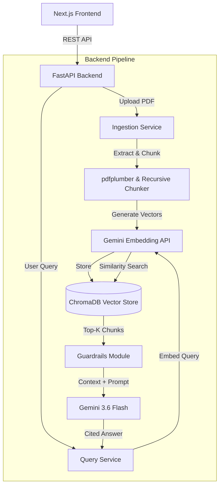

# DocuMind Technical Documentation

This document provides a deep dive into the architecture, design decisions, and algorithms behind DocuMind. It is intended for technical reviewers, engineers, and recruiters interested in understanding the inner workings of the system.

---

## 1. System Overview

DocuMind is an advanced Retrieval-Augmented Generation (RAG) application. It bridges the gap between static PDF documents and interactive AI by allowing users to ask natural language questions and receive accurate, cited answers. 

A primary focus of DocuMind is **trust and safety**. To mitigate the common issue of LLM hallucinations, the system employs a custom **Confidence Scoring & Guardrail** module that mathematically evaluates the relevance of the retrieved context before generating an answer.

---

## 2. High-Level Architecture

The system follows a decoupled client-server architecture.

### 2.1 The Tech Stack

- **Frontend:** Next.js 14, React, Tailwind CSS. Chosen for server-side rendering capabilities, fast initial loads, and an extensive React ecosystem.
- **Backend:** Python 3.11, FastAPI. Chosen for native asynchronous request handling (via `asyncio`) and speed. FastAPI's auto-generated Swagger UI also makes API testing trivial.
- **Vector Database:** ChromaDB. A lightweight, embedded vector database optimized for AI workloads. Used for fast K-Nearest Neighbor (KNN) vector similarity searches.
- **AI Models:** Google Gemini API (`gemini-embedding-001` for embeddings, `gemini-3.6-flash` for generation). Selected for generous free-tier rate limits and high inference speed.

---

## 3. The RAG Pipeline

### 3.1 Ingestion Phase
When a user uploads a PDF, the document undergoes several transformations before it can be queried:

1. **Text Extraction:** `pdfplumber` reads the PDF page-by-page. Unlike simple extractors, it preserves structural integrity and exact page numbers.
2. **Recursive Chunking:** Documents are split into smaller chunks (e.g., ~500 characters with a 50-character overlap) to ensure the LLM receives highly targeted context. Overlaps prevent sentences from being cut in half.
3. **Embedding Generation:** Each chunk is passed to the Gemini Embedding API, which converts the text into a high-dimensional vector space.
4. **Vector Storage:** The vectors, along with metadata (Document ID, Page Number, Text Snippet), are saved to ChromaDB.

### 3.2 Query Phase
1. **Query Embedding:** The user's natural language question is converted into a vector using the same embedding model.
2. **Retrieval:** ChromaDB performs a cosine similarity search, retrieving the top $K$ chunks (usually $K=8$) closest to the question vector.
3. **Context Injection:** The retrieved text chunks are formatted into a rigid system prompt.
4. **Generation:** Gemini reads the strict system prompt and the context, generating a markdown-formatted answer with exact page citations.

---

## 4. Hallucination Guardrails & Confidence Scoring

One of the most complex engineering challenges in RAG systems is preventing the LLM from confidently providing incorrect answers (hallucinations) when the retrieved context doesn't actually contain the answer.

DocuMind solves this using **Cosine Distance Thresholding**.

### The Algorithm
When ChromaDB retrieves the top chunks, it returns the **Cosine Distance** between the question vector and the chunk vectors. 

- Distance `0.0`: Perfect match.
- Distance `> 1.0`: Weak match / unrelated.

DocuMind calculates a **Confidence Score** by averaging the distances of the top 3 chunks:

$$ \text{Confidence} = \max\left(0, 1 - \frac{\text{Avg Distance}}{2.0}\right) \times 100 $$

Based on empirical testing, thresholds are set to classify the trustworthiness of the answer:
- **70% - 100% (Green):** Strong semantic match. The answer is highly reliable.
- **40% - 69% (Yellow):** Moderate match. The answer might be partially correct or tangential.
- **0% - 39% (Red):** Weak match. The system flags a **Hallucination Risk**. The UI warns the user that the retrieved context likely does not support the answer.

*Note: If the LLM strictly follows its system prompt and replies with an honest refusal (e.g., "I don't have enough information"), the confidence score is overridden to 100%, as the system behaved correctly.*

---

## 5. Recently Implemented Advanced Features

- **Query Analytics & Telemetry:** Built-in instrumentation tracks the execution time of the retrieval phase vs. the generation phase. This data is aggregated in a per-session `metrics` endpoint to help monitor pipeline bottlenecks.
- **Conversational Memory:** The system retains a rolling window of the last 3 turns (6 messages). This history is injected into the context window, allowing users to ask follow-up questions using pronouns (e.g., *"Can you summarize that last point?"*).
- **Dynamic Multi-Document Filtering:** Users can dynamically select a subset of uploaded documents to query against. This is implemented via metadata `$in` filters in ChromaDB, preventing context pollution from unrelated documents.

---

## 6. Future Roadmap & Scalability

If DocuMind were to be scaled to thousands of users, the following architectural changes would be prioritized:

1. **Move from Embedded to Client-Server Vector DB:** Migrate from embedded ChromaDB to a managed vector database like Pinecone or Qdrant to support distributed queries.
2. **Message Queues for Ingestion:** Offload the PDF chunking and embedding pipeline to a background worker (e.g., Celery + Redis) so large PDFs don't block the FastAPI event loop.
3. **Advanced Retrieval Techniques:** Implement Hybrid Search (BM25 Keyword Search + Vector Search) and Re-ranking models (e.g., Cohere Re-rank) to improve retrieval accuracy on domain-specific acronyms.
